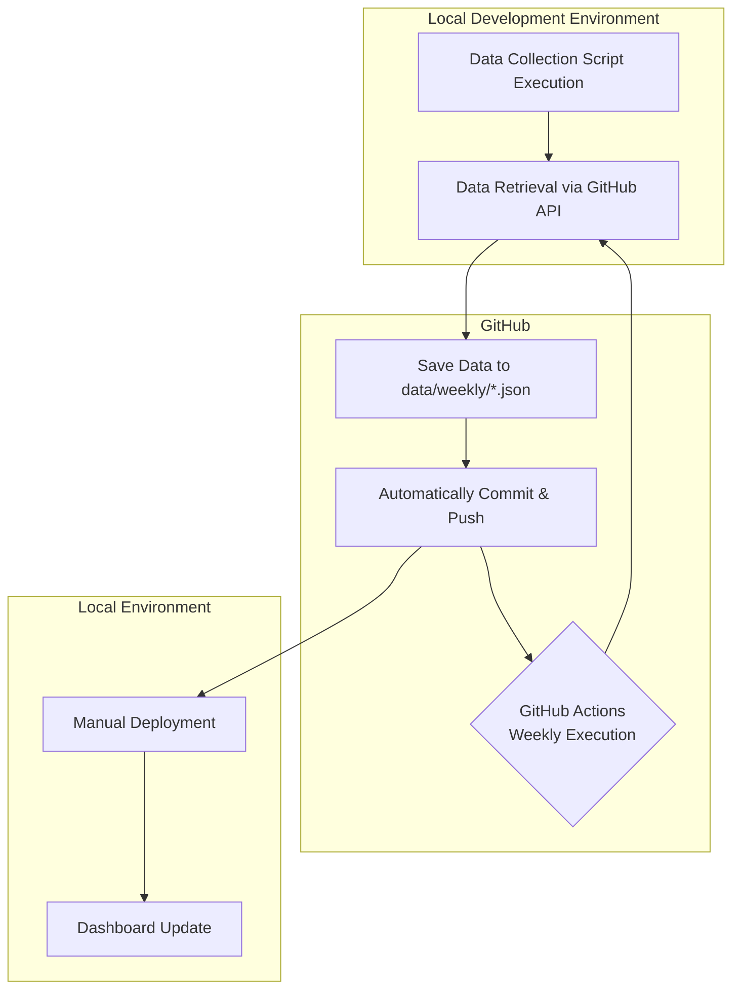

# 📊 PR Analytics

[](https://opensource.org/licenses/MIT)

**Unlock your team's development process with data.**

PR Analytics is an open-source dashboard that automatically analyzes Pull Requests from GitHub repositories, visualizing team productivity and development cycle bottlenecks.

---

## ✨ Key Features

- **🤖 Fully Automated Data Updates:** Set it up once, and GitHub Actions automatically collects and updates data weekly.
- **👀 Intuitive Dashboard:** Visualize key metrics like PR count, merge time, and review interactions in an easy-to-understand format.
- **👥 Team and Individual Insights:** Drill down from overall team trends to individual member activity.
- **🔓 Open Source:** All code is publicly available and free to use. Customize as needed for your requirements.

## 🚀 Get Started in 3 Minutes

Easy setup in your local environment.

<details>
<summary>🐳 Running Locally with Docker</summary>

1.  Clone the repository:

    ```bash
    git clone https://github.com/hidetoshitai/easy-pr-analytics.git
    cd easy-pr-analytics
    ```

2.  Create `.env.local` file:

    ```bash
    # GitHub Personal Access Token (repo permission required)
    GITHUB_TOKEN=your_github_token_here
    ```

3.  Install dependencies:

    ```bash
    npm install
    ```

4.  Start development server:

    ```bash
    npm run dev
    ```

5.  Open [http://localhost:3000](http://localhost:3000) in your browser.

</details>

## How to Use

1.  **Repository Configuration:** Set up repositories to analyze in `config/repositories.json`.
2.  **Data Collection:** Execute manual data collection in local environment or use GitHub Actions automatic collection.
3.  **Analysis:** Access the deployed site and review analysis results in the dashboard.

## 🔧 How It Works

This tool adopts a "GitOps" approach, using Git as a database.



1.  Local environment or GitHub Actions collects PR data and commits it directly to the **Git repository as JSON files**.
2.  Manually build the site in local environment to reflect the latest data.
3.  Every week, GitHub Actions automatically repeats this process, keeping data always up to date.

## 🔄 Automation & CI/CD

### GitHub Actions Workflows

- **📊 PR Data Validation (`pr-data-validation.yml`)**:

  - Automatically executes on pull request creation/update and pushes to main branch
  - Runs TypeScript type checking, ESLint, tests, and build checks
  - Verifies data collection API functionality
  - Basic data file integrity checks
  - Posts detailed validation results as PR comments

- **⏰ Weekly Data Update & Integrity Check (`weekly-data-update.yml`)**:
  - Automatically executes every Monday at 1 AM (UTC)
  - Manual execution also available
  - Updates data for all registered repositories to latest
  - Comprehensive data integrity checks before and after updates
  - API functionality verification
  - Automatic issue creation when problems are detected
  - Automatic generation and saving of detailed reports

### Environment Restrictions

Data collection functionality operates only in **local environment (`NODE_ENV=development`)** for security reasons. In production environment, only data viewing and analysis functions are available.

## 📊 Key Features and Analysis Items

### 🎯 Dashboard Features

- **📈 Overall Metrics**:

  - Total PR count, merge rate, average merge time
  - Active developer count, weekly averages

- **📊 Weekly Trend Analysis**:

  - PR count, lines changed, merge time trends
  - Period comparison functionality

- **👥 Member Statistics**:

  - Individual performance analysis
  - PR count, merge time, comment count
  - Detailed member view

- **🏷️ Label Analytics**:

  - Classification of bugs, technical debt, feature additions
  - Time series trends and ratio analysis

- **⏱️ Cycle Time Analysis**:

  - Detailed time breakdown from creation to merge
  - Bottleneck identification

- **🔄 Code Churn Analysis**:

  - Commit count and review round analysis
  - Utilization as quality metrics

- **💬 Comment Interaction Analysis**:

  - Review interaction patterns
  - Team communication analysis

- **📤 Data Export**:
  - Data output in JSON/CSV format

### 🎨 UI/UX Features

- **🌙 Dark Mode Support**
- **📱 Responsive Design**
- **👤 User Exclusion Settings**
- **📅 Period Selection and Filtering**

## 📋 Prerequisites

- Node.js 20 or higher
- GitHub Personal Access Token (with `repo` permission)

## 🛠️ Setup

### 1. Clone Repository

```bash
git clone https://github.com/hidetoshitai/easy-pr-analytics.git
cd easy-pr-analytics
```

### 2. Install Dependencies

```bash
npm install
```

### 3. Environment Configuration

```bash
# Create .env.local file
echo "GITHUB_TOKEN=your_github_token_here" > .env.local
```

### 4. Repository Configuration

Edit `config/repositories.json`:

```json
{
  "default": [
    {
      "owner": "your-organization",
      "repo": "your-repository"
    }
  ],
  "metadata": {
    "version": "1.0.0",
    "description": "PR Analytics target repository configuration",
    "lastUpdated": "2025-01-17T00:00:00Z",
    "maintainer": "SRE Team"
  },
  "validation": {
    "requiredFields": ["owner", "repo"],
    "maxRepositories": 10
  }
}
```

### 5. Start Development Server

```bash
npm run dev
```

The application will be accessible at http://localhost:3000.

## 🔧 Configuration Management

### GitHub Token Configuration

The following permissions are required:

- `repo`: Private repository access
- `read:org`: Organization information read access (optional)

### Repository Configuration Management

**Management Commands**:

```bash
# Validate configuration
npm run config:validate

# Display configuration content
npm run config:show

# Output in JSON format (for GitHub Actions)
npm run config:json
```

## 🤖 Data Collection and Scripts

### Data Collection Flow

1. **Manual Collection (Local Environment)**:

   ```bash
   npm run update-data
   ```

2. **Automatic Collection (GitHub Actions)**:

   - Automatically executes every Monday at 1 AM (UTC)
   - Manual execution also available

3. **Data Validation**:
   ```bash
   npm run validate:data
   ```

## 📱 Environment Restrictions

### Development Environment (localhost)

- ✅ All features available
- ✅ Data collection functionality
- ✅ Manual data updates

### Production Environment

- ✅ Dashboard viewing
- ✅ Data analysis and visualization
- ❌ Data collection functionality (hidden)
- ❌ Manual update buttons (hidden)

> **Security Consideration**: Production environment provides only data viewing and analysis functions, with data collection executed solely through GitHub Actions automation.

## 🤝 Contributing

1. Fork this repository
2. Create a feature branch (`git checkout -b feature/amazing-feature`)
3. Commit your changes (`git commit -m 'Add amazing feature'`)
4. Push to the branch (`git push origin feature/amazing-feature`)
5. Create a Pull Request

## 📄 License

MIT License - See [LICENSE](LICENSE) file for details

## Issue Reporting

- Bug Reports: GitHub Issues
- Feature Requests: GitHub Discussions
- Security Issues: Private reporting
