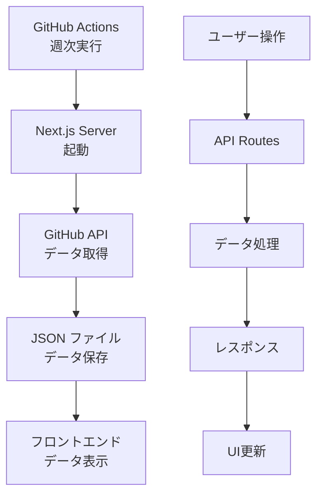

# 📊 PR Analytics

GitHub Pull Request とチームパフォーマンスを分析・可視化する Next.js アプリケーション

## 🎯 プロジェクト概要

PR Analytics は、GitHub リポジトリの Pull Request データを自動収集・분析하여 チームの開発パフォーマンスを可視化するツールです。週次でデータを自動更新し、直感的なダッシュボードでプロジェクトの健康状態を把握できます。

### 🌟 主要な価値

- **生産性の可視化**: PR 作成数、マージ率、レビュー時間などを追跡
- **チーム分析**: メンバー別のコントリビューション状況を把握
- **トレンド分析**: 過去 52 週間の推移とパターンを発見
- **自動化**: 手動作業なしでデータが週次更新される

## ✨ 主要機能

### 📈 ダッシュボード機能

- **総合指標**: PR 数、マージ率、平均レビュー時間
- **トレンド分析**: 週次/月次の推移グラフ
- **メンバー統計**: 個人別のパフォーマンス分析
- **ラベル分析**: ラベル別の PR 分類と統計

### 🤖 自動データ収集

- **週次自動更新**: 毎週月曜日 1:00 UTC に実行
- **過去データ補完**: 初回実行時に過去 52 週間分を自動取得
- **複数リポジトリ対応**: 設定した全リポジトリを一括処理
- **エラーハンドリング**: 部分的失敗時も処理継続

### 🎨 UI/UX

- **レスポンシブデザイン**: PC・モバイル両対応
- **ダークモード**: 目に優しい表示切替
- **リアルタイム更新**: データ変更の即座反映
- **直感的操作**: シンプルで分かりやすいインターフェース

## 🛠 技術スタック

### フロントエンド

- **Next.js 15.3.4** - React フレームワーク
- **React 19** - UI ライブラリ
- **TypeScript** - 型安全な開発
- **Tailwind CSS 4** - スタイリング
- **Chart.js & Recharts** - データ可視化

### バックエンド・API

- **Next.js API Routes** - サーバーサイド処理
- **Octokit** - GitHub API クライアント
- **Node.js** - ランタイム環境

### 開発・テスト

- **Vitest** - 高速テストフレームワーク
- **ESLint** - コード品質管理
- **GitHub Actions** - CI/CD パイプライン

### データ管理

- **JSON ファイル** - 週次データストレージ
- **SWR** - データフェッチング・キャッシュ
- **date-fns** - 日付処理

## 🚀 セットアップ

### 1. 前提条件

- **Node.js 20.x** 以上
- **npm** または **yarn**
- **GitHub Personal Access Token**

### 2. リポジトリのクローン

```bash
git clone https://github.com/your-org/pr-analytics.git
cd pr-analytics
```

### 3. 依存関係のインストール

```bash
npm install
# または
yarn install
```

### 4. 環境変数の設定

`.env.local` ファイルを作成し、以下を設定：

```env
# GitHub Personal Access Token (必須)
GITHUB_TOKEN=ghp_xxxxxxxxxxxxxxxxxxxx

# オプション設定
NODE_ENV=development
```

#### GitHub Token の取得方法

1. GitHub → Settings → Developer settings → Personal access tokens
2. "Generate new token (classic)" をクリック
3. 必要な権限を選択：
   - `repo` - プライベートリポジトリアクセス用
   - `public_repo` - パブリックリポジトリのみの場合

### 5. 開発サーバーの起動

```bash
npm run dev
```

ブラウザで [http://localhost:3000](http://localhost:3000) を開く

## 📋 使用方法

### 🎯 基本的な使い方

#### 1. リポジトリの追加

- ダッシュボードで「リポジトリを追加」をクリック
- Owner（組織名・ユーザー名）と Repository 名を入力
- 「分析開始」で追加完了

#### 2. データの表示

- 登録したリポジトリを選択
- 自動的にデータが読み込まれ、ダッシュボードが表示される

#### 3. 分析機能の活用

- **総合指標**: プロジェクト全体の健康状態を確認
- **トレンド**: 時系列での変化パターンを把握
- **メンバー分析**: チーム内での役割分担を可視化
- **データエクスポート**: CSV 形式でデータをダウンロード

### 🔄 データ更新

#### 自動更新（推奨）

- 毎週月曜日 1:00 UTC に自動実行
- GitHub Actions で完全自動化
- エラー時は自動で Issue 作成

#### 手動更新

```bash
# 通常の更新（新しいデータのみ）
npm run update-data

# 強制更新（全データを再取得）
npm run update-data:force

# ローカルテスト実行
npm run test:local
```

## 🏗 アーキテクチャ

### ディレクトリ構造

```
pr-analytics/
├── src/
│   ├── app/                    # Next.js App Router
│   │   ├── api/               # API エンドポイント
│   │   │   ├── analytics/     # 分析データ API
│   │   │   ├── collect-data/  # データ収集 API
│   │   │   ├── export/        # データエクスポート API
│   │   │   └── repositories/  # リポジトリ管理 API
│   │   ├── globals.css        # グローバルスタイル
│   │   ├── layout.tsx         # レイアウトコンポーネント
│   │   └── page.tsx           # メインページ
│   ├── components/            # React コンポーネント
│   │   ├── analytics/         # 分析表示コンポーネント
│   │   ├── AnalyticsDashboard.tsx
│   │   ├── Dashboard.tsx
│   │   └── DateRangeSelector.tsx
│   ├── hooks/                 # カスタムフック
│   ├── lib/                   # ユーティリティライブラリ
│   └── types/                 # TypeScript 型定義
├── data/
│   └── weekly/                # 週次データストレージ
│       └── {owner}/
│           └── {repo}/
│               └── {YYYY-WXX}.json
├── scripts/                   # バッチスクリプト
│   ├── update-weekly-data.mjs # メインデータ更新スクリプト
│   ├── local-test.mjs         # ローカルテスト用
│   └── debug-server.mjs       # デバッグ用サーバー
├── .github/
│   └── workflows/
│       └── weekly-data-update.yml # 自動更新ワークフロー
└── docs/                      # ドキュメント
```

### データフロー



## 🔧 API 仕様

### データ収集 API

#### `POST /api/collect-data`

指定したリポジトリ・週のデータを収集

```typescript
// リクエスト
{
  owner: string; // リポジトリオーナー
  repo: string; // リポジトリ名
  week: string; // 週指定 (YYYY-WXX)
}

// レスポンス
{
  success: boolean;
  message: string;
  prCount: number;
  week: string;
}
```

#### `GET /api/collect-data?owner={owner}&repo={repo}`

既存データの確認

```typescript
// レスポンス
{
  availableWeeks: string[];  // 利用可能な週のリスト
  lastCollected: string;     // 最後に収集した週
}
```

### 分析データ API

#### `GET /api/analytics?owner={owner}&repo={repo}&from={date}&to={date}`

指定期間の分析データを取得

```typescript
// レスポンス
{
  metrics: {
    totalPRs: number;
    mergeRate: number;
    avgTimeToMerge: number;
    // ... その他の指標
  };
  trends: WeeklyData[];
  members: MemberStats[];
}
```

### リポジトリ管理 API

#### `GET /api/repositories`

登録済みリポジトリ一覧を取得

```typescript
// レスポンス
{
  repositories: Array<{
    owner: string;
    repo: string;
  }>;
}
```

## 🤖 自動データ更新システム

### GitHub Actions ワークフロー

#### 実行スケジュール

- **定期実行**: 毎週月曜日 1:00 UTC
- **手動実行**: GitHub Actions 画面から随時実行可能

#### 設定方法

`.github/workflows/weekly-data-update.yml` で対象リポジトリを設定：

```yaml
env:
  DEFAULT_REPOSITORIES: |
    [
      {
        "owner": "your-org",
        "repo": "your-repo"
      },
      {
        "owner": "another-org", 
        "repo": "another-repo"
      }
    ]
```

#### 手動実行時のオプション

| パラメータ     | 説明                        | デフォルト           |
| -------------- | --------------------------- | -------------------- |
| `force_update` | 既存データを強制上書き      | false                |
| `repositories` | 対象リポジトリ（JSON 配列） | DEFAULT_REPOSITORIES |

### データ収集プロセス

1. **環境準備**: Node.js セットアップ、依存関係インストール
2. **アプリ起動**: Next.js を本番モードで起動
3. **リポジトリ取得**: 設定からリポジトリリストを読み込み
4. **データ収集**: 各リポジトリの過去 52 週間分をチェック・取得
5. **差分更新**: 不足している週のデータのみを効率的に収集
6. **結果レポート**: 成功・失敗・スキップ状況を詳細に表示
7. **自動コミット**: 新規データがある場合に自動でコミット・プッシュ

### エラーハンドリング

- **部分的失敗**: 一部リポジトリで失敗しても他は継続
- **自動 Issue 作成**: 完全失敗時に詳細情報付きで Issue を自動作成
- **リトライ機能**: API レート制限やネットワークエラーに対応

## 🧪 開発・テスト

### テストの実行

```bash
# 全テスト実行
npm test

# UI付きテスト実行
npm run test:ui

# ワンショット実行
npm run test:run

# カバレッジ付き実行
npm run test:run -- --coverage
```

### ローカル開発

```bash
# 開発サーバー（Turbopack）
npm run dev

# 本番ビルド
npm run build

# 本番サーバー起動
npm start

# Lint チェック
npm run lint
```

### デバッグ

```bash
# デバッグサーバー起動
npm run debug:server

# ローカルテスト（ドライラン）
npm run test:local:dry

# 強制更新テスト
npm run test:local:force
```

## 📊 データ形式

### 週次データ構造

```typescript
interface WeeklyPRData {
  week: string; // "2024-W26"
  repository: {
    owner: string;
    name: string;
  };
  prs: Array<{
    id: number;
    number: number;
    state: "open" | "closed";
    created_at: string;
    merged_at: string | null;
    title: string;
    user: {
      login: string;
      avatar_url: string;
    };
    labels: Array<{
      name: string;
      color: string;
    }>;
    additions: number;
    deletions: number;
    changed_files: number;
    comments: number;
    review_comments: number;
    commits: number;
    reviews: Array<unknown>;
    comment_list: Array<{
      user: {
        login: string;
        avatar_url: string;
      };
    }>;
    review_comment_list: Array<{
      user: {
        login: string;
        avatar_url: string;
      };
    }>;
  }>;
  collected_at: string; // ISO 8601 format
}
```

### ファイル保存場所

```
data/weekly/{owner}/{repo}/{YYYY-WXX}.json
```

例：

```
data/weekly/microsoft/vscode/2024-W26.json
data/weekly/facebook/react/2024-W26.json
```

## 🚨 トラブルシューティング

### よくある問題と解決方法

#### 1. GitHub API Rate Limit エラー

**症状**: `API rate limit exceeded` エラー

**解決方法**:

```bash
# 認証トークンを確認
echo $GITHUB_TOKEN

# レート制限状況を確認
curl -H "Authorization: token $GITHUB_TOKEN" \
  https://api.github.com/rate_limit
```

#### 2. ビルドエラー

**症状**: `npm run build` が失敗

**解決方法**:

```bash
# キャッシュクリア
rm -rf .next node_modules
npm install
npm run build
```

#### 3. データが表示されない

**症状**: ダッシュボードにデータが表示されない

**確認事項**:

- `data/weekly/` ディレクトリにファイルが存在するか
- GitHub Token の権限設定
- ブラウザのコンソールエラー

#### 4. 自動更新が動作しない

**症状**: GitHub Actions が失敗する

**確認事項**:

```yaml
# Secrets 設定を確認
- GITHUB_TOKEN または PERSONAL_ACCESS_TOKEN
- 権限: contents: write, issues: write
```

#### 5. パフォーマンスが遅い

**対処方法**:

- データ量が多い場合は期間を絞る
- ブラウザキャッシュをクリア
- 不要なリポジトリを削除

### ログの確認方法

#### GitHub Actions ログ

1. GitHub リポジトリの「Actions」タブ
2. 失敗したワークフローをクリック
3. 詳細なエラーログを確認

#### ローカル開発ログ

```bash
# デバッグモードで実行
DEBUG=* npm run dev

# サーバーログの詳細表示
npm run debug:server
```

## 🤝 コントリビューション

### 開発への参加

1. **Fork** このリポジトリ
2. **Feature Branch** を作成 (`git checkout -b feature/amazing-feature`)
3. **Commit** 変更内容 (`git commit -m 'Add amazing feature'`)
4. **Push** to the branch (`git push origin feature/amazing-feature`)
5. **Pull Request** を開く

### コードスタイル

- **ESLint** ルールに従う
- **TypeScript** の型安全性を重視
- **コメント** は日本語で記述
- **テスト** を必ず追加

### 報告・提案

- **Bug Report**: Issues で詳細な再現手順を含めて報告
- **Feature Request**: 具体的な用途と利点を明記
- **Documentation**: 改善提案やタイポ修正も歓迎

## 📄 ライセンス

このプロジェクトは [MIT License](LICENSE) の下で公開されています。

## 🙋‍♀️ サポート

質問や問題がある場合：

1. **Documentation** を確認
2. **Issues** で既存の質問を検索
3. **新しい Issue** を作成して質問

---

**開発チーム**: PR Analytics Contributors  
**最終更新**: 2024 年 6 月
