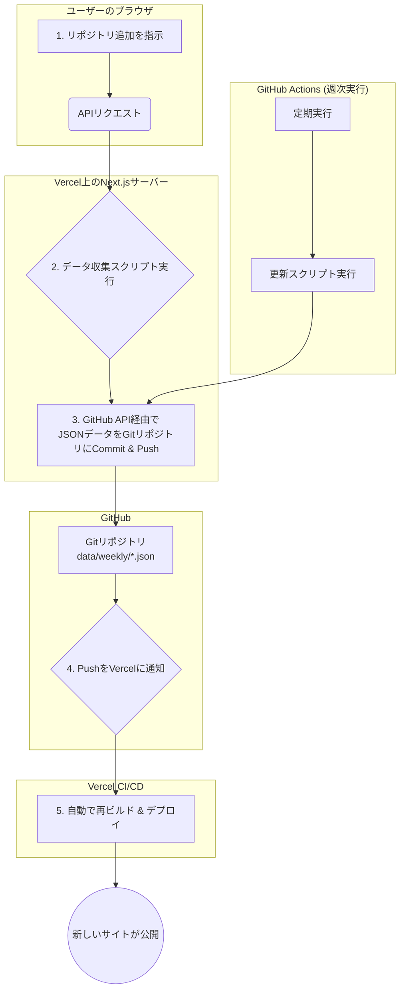

# 📊 PR Analytics

[](https://vercel.com/new/clone?repository-url=https%3A%2F%2Fgithub.com%2Fhidetoshitai%2Fpr-analytics&env=GITHUB_TOKEN&envDescription=GitHub%20Personal%20Access%20Token%20is%20required%20for%20fetching%20data.&project-name=pr-analytics&repository-name=pr-analytics)
[](https://opensource.org/licenses/MIT)

**あなたのチームの開発プロセスを、データで解き明かそう。**

PR Analytics は、GitHub リポジトリの Pull Request を自動で分析し、チームの生産性や開発サイクルのボトルネックを可視化するオープンソースのダッシュボードです。面倒なセットアップは不要。ワンクリックであなた自身のアカウントにデプロイし、すぐに分析を始められます。

---

[**➡️ ライブデモを試す**](https://your-demo-url.com) | [**📄 ドキュメント**](https://your-docs-url.com) | [**💬 コミュニティ (GitHub Discussions)**](https://github.com/your-org/pr-analytics/discussions)

---

  
_(ここにダッシュボードのスクリーンショットを挿入)_

## ✨ 主な特徴 (Features)

- **🚀 ワンクリック・デプロイ:** サーバー管理は不要。Vercel に数分でデプロイ完了。
- **🤖 完全自動のデータ更新:** 一度設定すれば、GitHub Actions が毎週自動でデータを収集・更新。
- **👀 直感的なダッシュボード:** PR 数、マージ時間、レビューのやり取りなど、重要な指標を分かりやすく可視化。
- **👥 チームと個人のインサイト:** チーム全体の傾向から、メンバー一人ひとりの活動状況までドリルダウン。
- **💻 UI で完結する設定:** 分析したいリポジトリの追加・削除は、すべて Web サイト上で完結。設定ファイルの手動編集は不要です。
- **🔓 オープンソース:** すべてのコードが公開されており、無料で利用可能。必要に応じて自由にカスタマイズできます。

## 🚀 3 分で始める (Getting Started)

最も簡単な方法は Vercel を使うことです。

[](https://vercel.com/new/clone?repository-url=https%3A%2F%2Fgithub.com%2Fyour-org%2Fpr-analytics&env=GITHUB_TOKEN&envDescription=GitHub%20Personal%20Access%20Token%20is%20required%20for%20fetching%20data.&project-name=pr-analytics&repository-name=pr-analytics)

ボタンをクリックすると、Vercel の画面が開きます。

1.  あなたの GitHub アカウントに `pr-analytics` リポジトリが作成されます。
2.  環境変数 `GITHUB_TOKEN` の入力を求められます。データ収集用の[GitHub Personal Access Token](https://docs.github.com/ja/authentication/keeping-your-account-and-data-secure/managing-your-personal-access-tokens#creating-a-personal-access-token-classic) (`repo` スコープを持つもの) を設定してください。
3.  「Deploy」ボタンを押せば、数分後にあなた専用の PR Analytics ダッシュボードが利用可能になります。

<details>
<summary>🐳 Dockerを使ったローカルでの実行方法</summary>

1.  リポジトリをクローン:

    ```bash
    git clone https://github.com/your-org/pr-analytics.git
    cd pr-analytics
    ```

2.  `.env` ファイルを作成:

    ```bash
    cp .env.example .env
    ```

3.  `.env` ファイルを編集し、`GITHUB_TOKEN` を設定します。

4.  Docker Compose を起動:

    ```bash
    docker-compose up
    ```

5.  ブラウザで [http://localhost:3000](http://localhost:3000) を開きます。

</details>

## 使い方 (How to Use)

1.  **リポジトリの追加:** デプロイしたサイトにアクセスし、ダッシュボード上の「リポジトリを追加」ボタンから、分析したいリポジトリ（例: `owner/repo-name`）を追加します。
2.  **データ収集:** リポジトリを追加すると、初期データの収集がバックグラウンドで自動的に開始されます。
3.  **分析:** データ収集が完了すると、ダッシュボードに分析結果が表示されます。データは毎週自動で更新されます。

## 🔧 簡単な仕組み (How It Works)

このツールは、Git をデータベースのように使う「GitOps」のアプローチを採用しています。



1.  ユーザーが UI からリポジトリを追加すると、API が PR データを収集し、JSON ファイルとして**あなたの GitHub リポジトリに直接コミット**します。
2.  リポジトリへのプッシュを検知した Vercel が、**自動的にサイトを再ビルド**し、最新のデータを反映させます。
3.  毎週、GitHub Actions がこのプロセスを自動で繰り返し、常にデータを最新の状態に保ちます。

## 🔄 自動化と CI/CD (Automation & CI/CD)

このプロジェクトは完全な自動化をサポートしています：

### GitHub Actions ワークフロー

- **📊 PR Data Validation (`pr-data-validation.yml`)**:

  - プルリクエスト作成・更新時と main/develop ブランチへのプッシュ時に自動実行
  - TypeScript 型チェック、ESLint、テスト、ビルドチェックを実行
  - データ収集 API の動作確認
  - データファイル整合性の基本チェック
  - PR に検証結果を詳細コメント

- **⏰ Weekly Data Update & Integrity Check (`weekly-data-update.yml`)**:

  - 毎週月曜日午前 1 時（UTC）に自動実行（**唯一の定期実行ワークフロー**）
  - 手動実行も可能（update_only、check_only、update_and_check の 3 モード選択可能）
  - すべての登録済みリポジトリのデータを最新に更新
  - 更新前後でデータ整合性を包括的にチェック
  - API 機能の動作確認
  - 問題発見時は自動で Issue 作成
  - 詳細レポートを自動生成・保存

### 本番環境での制限

データ収集機能は、セキュリティ上の理由から**ローカル環境（`NODE_ENV=development`）でのみ動作**します。本番環境では、データの閲覧・分析機能のみが利用可能です。

## 🤝 コミュニティに参加する (Contributing)

このプロジェクトはコミュニティによって支えられています。バグ報告、機能提案、改善など、あらゆる形のコントリビューションを歓迎します！

- **💬 質問やアイデアの共有:** [GitHub Discussions](https://github.com/your-org/pr-analytics/discussions) が最適な場所です。
- **🐞 バグ報告:** [GitHub Issues](https://github.com/your-org/pr-analytics/issues) から報告してください。
- **✍️ 開発への参加:** `CONTRIBUTING.md`（作成予定）を読んで、ぜひ Pull Request を送ってください！

## 🛠 技術スタック (Tech Stack)

- **Framework**: Next.js
- **Language**: TypeScript
- **UI**: React, Tailwind CSS
- **Data Visualization**: Recharts
- **CI/CD & Hosting**: Vercel, GitHub Actions
- **Testing**: Vitest

## 📄 ライセンス (License)

このプロジェクトは [MIT License](LICENSE) の下で公開されています。

## 🏗️ アーキテクチャ

- **フロントエンド**: Next.js 15 + TypeScript + Tailwind CSS
- **データ収集**: GitHub REST API + 週次バッチ処理
- **CI/CD**: GitHub Actions（SRE ベストプラクティス準拠）
- **データストレージ**: ローカル JSON ファイル + クライアントサイドキャッシュ

## 🚀 主要機能

### 📊 分析機能

- **PR メトリクス**: 作成数、マージ率、サイクルタイム分析
- **メンバー統計**: 個人別パフォーマンス分析とトレンド
- **コード変更分析**: 追加・削除行数、チャーンレート
- **レビュー分析**: コメント傾向、インタラクション分析
- **ラベル統計**: ラベル別分析とタイムライン可視化

### 🔄 自動化

- **定期データ収集**: 毎週月曜日午前 1 時（UTC）自動実行
- **品質保証**: PR 作成時の自動検証（コード品質・機能・データ整合性）
- **障害対応**: 自動 Issue 作成・SLI 監視・段階的復旧

## 📋 前提条件

- Node.js 20 以上
- GitHub Personal Access Token（`repo`権限）

## 🛠️ セットアップ

### 1. リポジトリクローン

```bash
git clone https://github.com/your-org/pr-analytics.git
cd pr-analytics
```

### 2. 依存関係インストール

```bash
npm install
```

### 3. 環境設定

```bash
# GitHub Personal Access Tokenを設定
export GITHUB_TOKEN="your_github_token_here"

# 対象リポジトリを設定
export TARGET_REPOSITORIES='[{"owner":"your-org","repo":"your-repo"}]'
```

### 4. 開発サーバー起動

```bash
npm run dev
```

アプリケーションは http://localhost:3000 でアクセスできます。

## 🔧 設定

### GitHub Token 設定

以下の権限が必要です：

- `repo`: プライベートリポジトリアクセス
- `read:org`: Organization 情報読み取り（オプション）

### リポジトリ設定（一元管理）

**設定ファイル**: `config/repositories.json`

```json
{
  "default": [
    {
      "owner": "your-organization",
      "repo": "your-repository"
    }
  ],
  "metadata": {
    "version": "1.0.0",
    "description": "PR Analytics対象リポジトリ設定",
    "lastUpdated": "2025-01-17T00:00:00Z",
    "maintainer": "SRE Team"
  },
  "validation": {
    "requiredFields": ["owner", "repo"],
    "maxRepositories": 10
  }
}
```

**管理コマンド**:

```bash
# 設定の検証
npm run config:validate

# 設定内容の表示
npm run config:show

# JSON形式での出力（GitHub Actions用）
npm run config:json
```

**利点**:

- ✅ **DRY 原則**: 1 箇所での一元管理
- ✅ **バリデーション**: 自動的な設定検証
- ✅ **保守性**: 型安全な設定管理
- ✅ **可視性**: 設定変更の透明性

## 🤖 自動化システム（SRE ベストプラクティス準拠）

### 📅 定期データ更新

**ワークフロー**: `.github/workflows/weekly-data-update.yml`

- **スケジュール**: 毎週月曜日午前 1 時（UTC）
- **機能**:
  - 包括的データ収集と整合性チェック
  - API 機能動作確認
  - 自動障害検知・Issue 作成
  - 詳細レポート生成
- **SLI 目標**:
  - 実行時間: ≤30 分
  - 成功率: ≥95%
  - API 応答時間: ≤10 秒

**実行モード**:

- `update_and_check`: データ更新 + 整合性チェック（デフォルト）
- `update_only`: データ更新のみ
- `check_only`: 整合性チェックのみ

### 🧪 PR 検証システム

**ワークフロー**: `.github/workflows/pr-data-validation.yml`

**並列検証項目**:

1. **⚡ 高速事前チェック**:

   - 変更ファイル分析
   - セキュリティスキャン
   - 大容量ファイル検知

2. **🔍 コード品質** (並列実行):

   - TypeScript 型チェック
   - ESLint 品質チェック
   - 単体テスト実行

3. **🚀 機能テスト**:

   - アプリケーションビルド
   - API 動作確認
   - 性能チェック

4. **📊 データ整合性**:

   - JSON ファイル構造検証
   - データ内容検証

5. **🔒 セキュリティスキャン**:
   - 依存関係脆弱性チェック
   - 機密情報検知

### 🚨 障害対応システム

**自動 Issue 作成**:

- **P0 (Critical)**: システム健全性チェック失敗
- **P1 (High)**: データ更新・API 機能失敗
- **P2 (Medium)**: 一般的な実行エラー

**監視メトリクス**:

- 実行時間（SLI）
- 成功率
- データ整合性ステータス
- API 応答時間

## 📊 運用・監視

### 🎯 Service Level Indicators (SLI)

| SLI              | 目標値 | 監視方法             |
| ---------------- | ------ | -------------------- |
| データ更新成功率 | ≥95%   | GitHub Actions 結果  |
| 実行時間         | ≤30 分 | ワークフロー実行時間 |
| API 応答時間     | ≤10 秒 | 機能テスト内計測     |
| データ整合性     | 100%   | 自動チェック         |

### 📈 ダッシュボード

**メトリクス可視化**:

- PR サイクルタイム（作成〜マージ）
- レビュー効率（コメント数/PR）
- コード変更量（追加/削除行数）
- チーム生産性指標

**トレンド分析**:

- 週次/月次パフォーマンス比較
- メンバー別貢献度分析
- ラベル使用頻度とタイムライン

### 🔍 トラブルシューティング

#### よくある問題と解決方法

**1. GitHub API Rate Limit**

```bash
# 現在のレート制限確認
curl -H "Authorization: token $GITHUB_TOKEN" https://api.github.com/rate_limit

# 解決方法: Personal Access Tokenの使用、リクエスト頻度調整
```

**2. データ整合性エラー**

```bash
# データ整合性チェック実行
npm run validate:data

# 特定ファイルの検証
node -e "import('./scripts/common-utils.mjs').then(async ({checkDataIntegrity}) => console.log(await checkDataIntegrity()))"
```

**3. サーバー起動失敗**

```bash
# ポート競合確認
lsof -i :3000

# 環境変数確認
echo $GITHUB_TOKEN
echo $TARGET_REPOSITORIES
```

#### ログとデバッグ

**詳細ログ有効化**:

```bash
export DEBUG=*
npm run dev
```

**GitHub Actions デバッグ**:

- ワークフロー実行時に`debug_mode: true`を設定
- アーティファクトからレポートファイルをダウンロード

#### 緊急時対応

**データ復旧**:

1. バックアップからの復元（GitHub Actions アーティファクト）
2. 手動データ収集実行
3. 整合性チェック実行

**システム復旧**:

1. ワークフロー手動実行
2. 環境変数・シークレット確認
3. 必要に応じてホットフィックス適用

## 🔐 セキュリティ

### 認証・認可

- GitHub Personal Access Token 使用
- 最小権限の原則（`repo`権限のみ）
- 本番環境でのデータ収集機能制限

### データ保護

- 機密情報のログ出力防止
- 依存関係脆弱性監視
- 定期的なセキュリティ監査

### 運用セキュリティ

- OIDC 認証対応
- 並行実行制御
- タイムアウト設定

## 📱 環境別制限

### 開発環境（localhost）

- ✅ 全機能利用可能
- ✅ データ収集機能
- ✅ 手動データ更新

### 本番環境（デプロイ後）

- ✅ ダッシュボード閲覧
- ✅ データ分析・可視化
- ❌ データ収集機能（非表示）
- ❌ 手動更新ボタン（非表示）

> **セキュリティ考慮**: 本番環境ではデータ閲覧・分析機能のみ提供し、データ収集は GitHub Actions の自動化のみで実行します。

## 🛠️ 開発

### スクリプト

```bash
# 開発サーバー起動
npm run dev

# プロダクションビルド
npm run build

# 型チェック
npm run type-check

# リンター実行
npm run lint

# テスト実行
npm run test

# データ整合性チェック
npm run validate:data

# 週次データ更新（手動）
node scripts/update-weekly-data.mjs
```

### ディレクトリ構造

```
pr-analytics/
├── .github/workflows/          # CI/CDワークフロー
│   ├── weekly-data-update.yml  # 定期データ更新
│   └── pr-data-validation.yml  # PR検証
├── data/weekly/               # 週次データストレージ
├── scripts/                   # 自動化スクリプト
│   ├── common-utils.mjs      # 共通ユーティリティ
│   └── update-weekly-data.mjs # データ更新スクリプト
├── src/
│   ├── app/                  # Next.js App Router
│   ├── components/           # Reactコンポーネント
│   ├── hooks/               # カスタムフック
│   ├── lib/                 # ユーティリティライブラリ
│   └── types/               # TypeScript型定義
└── docs/                    # ドキュメント
```

### 品質保証

**自動テスト**:

- 単体テスト（Vitest）
- 型チェック（TypeScript）
- リンター（ESLint）

**継続的インテグレーション**:

- PR 作成時の自動検証
- 並列実行による高速フィードバック
- 包括的なエラーレポート

## 📈 パフォーマンス最適化

### フロントエンド

- Next.js 15 の最新機能活用
- クライアントサイドキャッシュ
- 画像最適化
- 遅延ローディング

### バックエンド

- API 効率化（バッチ処理）
- データ前処理とキャッシュ
- 並列データ取得

### CI/CD

- 並列ジョブ実行
- キャッシュ最適化
- 条件付き実行

## 🤝 貢献

1. このリポジトリをフォーク
2. 機能ブランチを作成 (`git checkout -b feature/amazing-feature`)
3. 変更をコミット (`git commit -m 'Add amazing feature'`)
4. ブランチにプッシュ (`git push origin feature/amazing-feature`)
5. Pull Request を作成

### 開発ガイドライン

- TypeScript 厳密モード使用
- ESLint・Prettier ルール遵守
- 単体テスト作成
- コミットメッセージ規約準拠

## 📄 ライセンス

MIT License - 詳細は[LICENSE](LICENSE)ファイルを参照

## 📞 サポート

### ドキュメント

- [ローカルセットアップガイド](docs/LOCAL_SETUP.md)
- [API 仕様書](docs/API.md)（予定）
- [運用手順書](docs/OPERATIONS.md)（予定）

### 問題報告

- バグ報告：GitHub Issues
- 機能要望：GitHub Discussions
- セキュリティ問題：プライベート報告

### 監視・アラート

- GitHub Actions 失敗時の自動 Issue 作成
- SLI 違反時のアラート
- 週次実行結果レポート

---

> 🤖 **SRE 準拠**: このプロジェクトは Site Reliability Engineering のベストプラクティスに準拠し、高い可用性、拡張性、保守性を実現しています。
