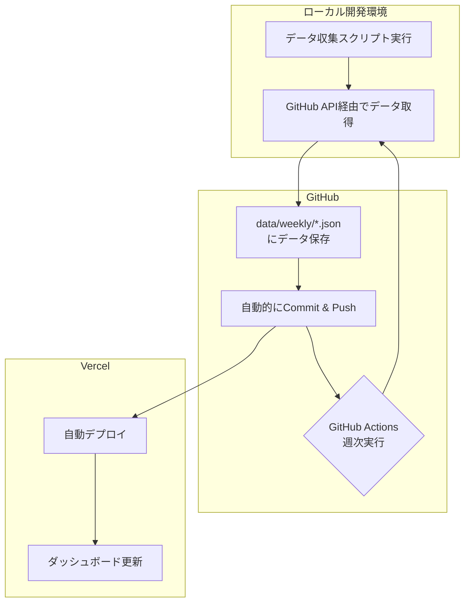

# 📊 PR Analytics

[](https://vercel.com/new/clone?repository-url=https%3A%2F%2Fgithub.com%2Fhidetoshitai%2Fpr-analytics&env=GITHUB_TOKEN&envDescription=GitHub%20Personal%20Access%20Token%20is%20required%20for%20fetching%20data.&project-name=pr-analytics&repository-name=pr-analytics)
[](https://opensource.org/licenses/MIT)

**あなたのチームの開発プロセスを、データで解き明かそう。**

PR Analytics は、GitHub リポジトリの Pull Request を自動で分析し、チームの生産性や開発サイクルのボトルネックを可視化するオープンソースのダッシュボードです。面倒なセットアップは不要。ワンクリックであなた自身のアカウントにデプロイし、すぐに分析を始められます。

---

## ✨ 主な特徴 (Features)

- **🚀 ワンクリック・デプロイ:** サーバー管理は不要。Vercel に数分でデプロイ完了。
- **🤖 完全自動のデータ更新:** 一度設定すれば、GitHub Actions が毎週自動でデータを収集・更新。
- **👀 直感的なダッシュボード:** PR 数、マージ時間、レビューのやり取りなど、重要な指標を分かりやすく可視化。
- **👥 チームと個人のインサイト:** チーム全体の傾向から、メンバー一人ひとりの活動状況までドリルダウン。
- **🔓 オープンソース:** すべてのコードが公開されており、無料で利用可能。必要に応じて自由にカスタマイズできます。

## 🚀 3 分で始める (Getting Started)

最も簡単な方法は Vercel を使うことです。

[](https://vercel.com/new/clone?repository-url=https%3A%2F%2Fgithub.com%2Fhidetoshitai%2Fpr-analytics&env=GITHUB_TOKEN&envDescription=GitHub%20Personal%20Access%20Token%20is%20required%20for%20fetching%20data.&project-name=pr-analytics&repository-name=pr-analytics)

ボタンをクリックすると、Vercel の画面が開きます。

1.  あなたの GitHub アカウントに `pr-analytics` リポジトリが作成されます。
2.  環境変数 `GITHUB_TOKEN` の入力を求められます。データ収集用の[GitHub Personal Access Token](https://docs.github.com/ja/authentication/keeping-your-account-and-data-secure/managing-your-personal-access-tokens#creating-a-personal-access-token-classic) (`repo` スコープを持つもの) を設定してください。
3.  「Deploy」ボタンを押せば、数分後にあなた専用の PR Analytics ダッシュボードが利用可能になります。

<details>
<summary>🐳 Dockerを使ったローカルでの実行方法</summary>

1.  リポジトリをクローン:

    ```bash
    git clone https://github.com/hidetoshitai/pr-analytics.git
    cd pr-analytics
    ```

2.  `.env.local` ファイルを作成:

    ```bash
    # GitHub Personal Access Token (repo権限が必要)
    GITHUB_TOKEN=your_github_token_here
    ```

3.  依存関係をインストール:

    ```bash
    npm install
    ```

4.  開発サーバーを起動:

    ```bash
    npm run dev
    ```

5.  ブラウザで [http://localhost:3000](http://localhost:3000) を開きます。

</details>

## 使い方 (How to Use)

1.  **リポジトリの設定:** `config/repositories.json` に分析したいリポジトリを設定します。
2.  **データ収集:** ローカル環境で手動データ収集を実行するか、GitHub Actions の自動収集を利用します。
3.  **分析:** デプロイしたサイトにアクセスし、ダッシュボードで分析結果を確認します。

## 🔧 簡単な仕組み (How It Works)

このツールは、Git をデータベースのように使う「GitOps」のアプローチを採用しています。



1.  ローカル環境または GitHub Actions が PR データを収集し、JSON ファイルとして**Git リポジトリに直接コミット**します。
2.  リポジトリへのプッシュを検知した Vercel が、**自動的にサイトを再ビルド**し、最新のデータを反映させます。
3.  毎週、GitHub Actions がこのプロセスを自動で繰り返し、常にデータを最新の状態に保ちます。

## 🔄 自動化と CI/CD (Automation & CI/CD)

### GitHub Actions ワークフロー

- **📊 PR Data Validation (`pr-data-validation.yml`)**:

  - プルリクエスト作成・更新時と main ブランチへのプッシュ時に自動実行
  - TypeScript 型チェック、ESLint、テスト、ビルドチェックを実行
  - データ収集 API の動作確認
  - データファイル整合性の基本チェック
  - PR に検証結果を詳細コメント

- **⏰ Weekly Data Update & Integrity Check (`weekly-data-update.yml`)**:
  - 毎週月曜日午前 1 時（UTC）に自動実行
  - 手動実行も可能
  - すべての登録済みリポジトリのデータを最新に更新
  - 更新前後でデータ整合性を包括的にチェック
  - API 機能の動作確認
  - 問題発見時は自動で Issue 作成
  - 詳細レポートを自動生成・保存

### 本番環境での制限

データ収集機能は、セキュリティ上の理由から**ローカル環境（`NODE_ENV=development`）でのみ動作**します。本番環境では、データの閲覧・分析機能のみが利用可能です。

## 🛠 技術スタック (Tech Stack)

- **Framework**: Next.js 15.3.4 (App Router)
- **Language**: TypeScript
- **Runtime**: React 19
- **UI**: Tailwind CSS 4
- **Data Visualization**: Recharts
- **API Client**: Octokit (GitHub REST API)
- **Testing**: Vitest, Testing Library
- **CI/CD & Hosting**: Vercel, GitHub Actions

## 📊 主要機能と分析項目

### 🎯 ダッシュボード機能

- **📈 全体メトリクス (Overall Metrics)**:

  - 総 PR 数、マージ率、平均マージ時間
  - アクティブ開発者数、週次平均値

- **📊 週次トレンド分析 (Weekly Trends)**:

  - PR 数、変更行数、マージ時間の推移
  - 期間比較機能

- **👥 メンバー統計 (Member Statistics)**:

  - 個人別パフォーマンス分析
  - PR 数、マージ時間、コメント数
  - 詳細なメンバービュー

- **🏷️ ラベル分析 (Label Analytics)**:

  - バグ、技術的負債、機能追加の分類
  - 時系列での推移と割合分析

- **⏱️ サイクルタイム分析 (Cycle Time Breakdown)**:

  - 作成からマージまでの詳細時間分解
  - ボトルネック特定

- **🔄 コード手戻り率分析 (Code Churn Analysis)**:

  - コミット数とレビューラウンド分析
  - 品質指標としての活用

- **💬 コメント相互作用分析 (Comment Interactions)**:

  - レビューの相互作用パターン
  - チーム内コミュニケーション分析

- **📤 データエクスポート (Data Export)**:
  - JSON/CSV 形式でのデータ出力

### 🎨 UI/UX 機能

- **🌙 ダークモード対応**
- **📱 レスポンシブデザイン**
- **👤 ユーザー除外設定**
- **📅 期間選択とフィルタリング**

## 📋 前提条件

- Node.js 20 以上
- GitHub Personal Access Token（`repo`権限）

## 🛠️ セットアップ

### 1. リポジトリクローン

```bash
git clone https://github.com/hidetoshitai/pr-analytics.git
cd pr-analytics
```

### 2. 依存関係インストール

```bash
npm install
```

### 3. 環境設定

```bash
# .env.local ファイルを作成
echo "GITHUB_TOKEN=your_github_token_here" > .env.local
```

### 4. リポジトリ設定

`config/repositories.json` を編集:

```json
{
  "default": [
    {
      "owner": "your-organization",
      "repo": "your-repository"
    }
  ],
  "metadata": {
    "version": "1.0.0",
    "description": "PR Analytics対象リポジトリ設定",
    "lastUpdated": "2025-01-17T00:00:00Z",
    "maintainer": "SRE Team"
  },
  "validation": {
    "requiredFields": ["owner", "repo"],
    "maxRepositories": 10
  }
}
```

### 5. 開発サーバー起動

```bash
npm run dev
```

アプリケーションは http://localhost:3000 でアクセスできます。

## 🔧 設定管理

### GitHub Token 設定

以下の権限が必要です：

- `repo`: プライベートリポジトリアクセス
- `read:org`: Organization 情報読み取り（オプション）

### リポジトリ設定の管理

**管理コマンド**:

```bash
# 設定の検証
npm run config:validate

# 設定内容の表示
npm run config:show

# JSON形式での出力（GitHub Actions用）
npm run config:json
```

## 🤖 データ収集とスクリプト

### 利用可能なスクリプト

```bash
# 開発サーバー起動（Turbopack使用）
npm run dev

# プロダクションビルド
npm run build

# プロダクションサーバー起動
npm run start

# リンター実行
npm run lint

# テスト実行
npm run test
npm run test:ui        # UIモード
npm run test:run       # 一回実行

# データ収集（ローカル環境のみ）
npm run update-data
npm run update-data:force    # 強制更新

# ローカルテスト
npm run test:local
npm run test:local:dry       # ドライラン
npm run test:local:force     # 強制実行

# デバッグ
npm run debug:server

# データ検証
npm run validate:data
```

### データ収集の流れ

1. **手動収集（ローカル環境）**:

   ```bash
   npm run update-data
   ```

2. **自動収集（GitHub Actions）**:

   - 毎週月曜日午前 1 時（UTC）に自動実行
   - 手動実行も可能

3. **データ検証**:
   ```bash
   npm run validate:data
   ```

## 🚨 トラブルシューティング

### よくある問題と解決方法

**1. GitHub API Rate Limit**

```bash
# 現在のレート制限確認
curl -H "Authorization: token $GITHUB_TOKEN" https://api.github.com/rate_limit
```

**2. データ整合性エラー**

```bash
# データ整合性チェック実行
npm run validate:data
```

**3. サーバー起動失敗**

```bash
# ポート競合確認
lsof -i :3000

# 環境変数確認
echo $GITHUB_TOKEN
```

### デバッグモード

```bash
# 詳細ログ有効化
DEBUG=* npm run dev

# デバッグサーバー起動
npm run debug:server
```

## 📱 環境別制限

### 開発環境（localhost）

- ✅ 全機能利用可能
- ✅ データ収集機能
- ✅ 手動データ更新

### 本番環境（デプロイ後）

- ✅ ダッシュボード閲覧
- ✅ データ分析・可視化
- ❌ データ収集機能（非表示）
- ❌ 手動更新ボタン（非表示）

> **セキュリティ考慮**: 本番環境ではデータ閲覧・分析機能のみ提供し、データ収集は GitHub Actions の自動化のみで実行します。

## 🛠️ 開発

### ディレクトリ構造

```
pr-analytics/
├── .github/workflows/          # CI/CDワークフロー
│   ├── weekly-data-update.yml  # 定期データ更新
│   └── pr-data-validation.yml  # PR検証
├── config/                     # 設定ファイル
│   └── repositories.json       # リポジトリ設定
├── data/weekly/               # 週次データストレージ
├── scripts/                   # 自動化スクリプト
│   ├── common-utils.mjs      # 共通ユーティリティ
│   ├── config-loader.mjs     # 設定ローダー
│   ├── debug-server.mjs      # デバッグサーバー
│   ├── local-test.mjs        # ローカルテスト
│   └── update-weekly-data.mjs # データ更新スクリプト
├── src/
│   ├── app/                  # Next.js App Router
│   │   ├── api/             # API Routes
│   │   │   ├── analytics/   # 分析API
│   │   │   ├── collect-data/ # データ収集API
│   │   │   ├── export/      # エクスポートAPI
│   │   │   └── repositories/ # リポジトリAPI
│   │   ├── globals.css      # グローバルスタイル
│   │   ├── layout.tsx       # ルートレイアウト
│   │   └── page.tsx         # メインページ
│   ├── components/           # Reactコンポーネント
│   │   ├── analytics/       # 分析コンポーネント
│   │   ├── AnalyticsDashboard.tsx
│   │   ├── Dashboard.tsx
│   │   ├── DataManager.tsx
│   │   ├── DateRangeSelector.tsx
│   │   └── Header.tsx
│   ├── hooks/               # カスタムフック
│   │   ├── useAnalyticsFilters.ts
│   │   ├── useDarkMode.ts
│   │   └── useGitHubData.ts
│   ├── lib/                 # ユーティリティライブラリ
│   │   ├── cookies.ts
│   │   ├── dataStorage.ts
│   │   ├── github.ts
│   │   └── weekFormat.ts
│   └── types/               # TypeScript型定義
│       └── analytics.ts
└── docs/                    # ドキュメント
    └── LOCAL_SETUP.md
```

### API エンドポイント

- **`GET /api/analytics`**: 分析データ取得
  - クエリパラメータ: `owner`, `repo`, `from`, `to`
- **`POST /api/collect-data`**: データ収集（ローカル環境のみ）
  - ボディ: `{owner, repo, week?}`
- **`GET /api/collect-data`**: 利用可能週データ一覧
  - クエリパラメータ: `owner`, `repo`
- **`GET /api/export`**: データエクスポート
  - クエリパラメータ: `owner`, `repo`, `format`
- **`GET /api/repositories`**: 設定済みリポジトリ一覧

### 品質保証

**自動テスト**:

- 単体テスト（Vitest）
- 型チェック（TypeScript）
- リンター（ESLint）

**継続的インテグレーション**:

- PR 作成時の自動検証
- 並列実行による高速フィードバック
- 包括的なエラーレポート

## 📈 パフォーマンス最適化

### フロントエンド

- Next.js 15 の最新機能活用
- Turbopack による高速開発
- クライアントサイドキャッシュ
- レスポンシブデザイン

### バックエンド

- API 効率化（バッチ処理）
- データ前処理とキャッシュ
- 並列データ取得

### CI/CD

- 並列ジョブ実行
- キャッシュ最適化
- 条件付き実行

## 🤝 貢献

1. このリポジトリをフォーク
2. 機能ブランチを作成 (`git checkout -b feature/amazing-feature`)
3. 変更をコミット (`git commit -m 'Add amazing feature'`)
4. ブランチにプッシュ (`git push origin feature/amazing-feature`)
5. Pull Request を作成

### 開発ガイドライン

- TypeScript 厳密モード使用
- ESLint・Prettier ルール遵守
- 単体テスト作成
- コミットメッセージ規約準拠

## 📄 ライセンス

MIT License - 詳細は[LICENSE](LICENSE)ファイルを参照

## 📞 サポート

### ドキュメント

- [ローカルセットアップガイド](docs/LOCAL_SETUP.md)

### 問題報告

- バグ報告：GitHub Issues
- 機能要望：GitHub Discussions
- セキュリティ問題：プライベート報告

---

> 🚀 **高品質な開発体験**: このプロジェクトはモダンな開発手法とベストプラクティスを採用し、高い保守性と拡張性を実現しています。
